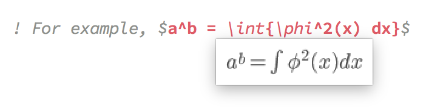
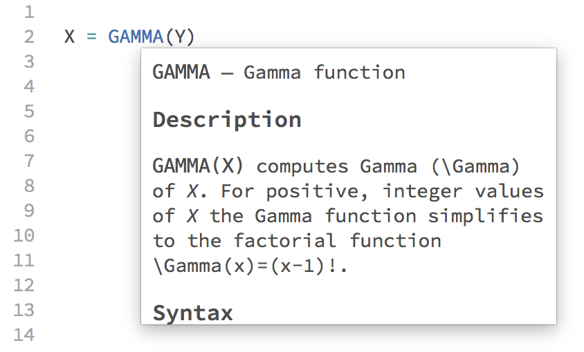

SublimeFortran
==============

Comprehensive syntax highlighting for Fortran in Sublime Text 3.

Features:

 - Linter based on `gfortran` (requires the package [SublimeLinter](https://github.com/SublimeLinter/SublimeLinter3) to work), highlights errors while you work:

    

 - Hover over inline latex in comments to see it rendered in a popup (requires build >= 3116):

    

 - Hover over intrinsic functions to see documentation in a popup (requires build >= 3116):

    

 - Code snippets

 - Indentation rules

 - Separate syntax definitions for fixed-format and modern Fortran.

 - Based on the new
   [sublime-syntax file format](http://www.sublimetext.com/docs/3/syntax.html)
   and therefore currently requires a recent [beta version](http://www.sublimetext.com/3)
   of Sublime Text 3 (minimum build number 3084).

Pull requests are welcome :)


## Installation ##

### Option 1: via Package Control (recommended) ###

1) Install [Package Control](https://packagecontrol.io/installation)

2) Open the command pallete via `ctrl+shift+p` (Win, Linux) or `cmd+shift+p` (OS X)

3) Choose `Package Control: Install Package`

4) Choose `Fortran`

5) The package will be installed and updated regularly by Package Control


### Option 2: clone the repository

1) In a terminal, `cd` into your Sublime Text Packages directory (which you can find via the menu option `Preferences → Browse Packages...`)

2) Clone the repository: `git clone https://github.com/315234/SublimeFortran.git Fortran` (note the local directory name at the end of the command line)

3) To update the package in future, return to the directory and run `git pull`


## Configuration ##

## Disabling documentation and latex popups ##

These can be turned on or off with the following settings:

```JSON
{
    "fortran_disable_docs": true,
    "fortran_disable_latex": true,
}

```

### Disabling rulers ###

The Fixed Form Fortran syntax included in this package sets some rulers to help code indentation and show where the 72 character limit is. If you find these distracting, they can be disabled by creating a language specific settings file.

To do this, create a file called `FortranFixedForm.sublime-settings` in your `Packages/User/` containing the following:
```JSON
{
    "rulers": []
}
```


### Using the linter ###

This package includes a linter based on SublimeLinter3. SublimeLinter user settings can be modified by selecting `SublimeLinter Settings - User` from the Command Palette.

You may need to tell SublimeLinter where `gfortran` is located by adding it to `paths` in SublimeLinter user settings:

```JSON
{
    "user": {
        "paths": {
            "linux": [],
            "osx": [
                "/usr/local/bin"
            ],
            "windows": []
        },
    }
}
```
Additional command line flags for `gfortran` may be also specified:
```JSON
{
    "user": {
        "linters": {
            "gfortranfixedform": {
                "@disable": false,
                "args": [
                    "-fdefault-real-8",
                    "-fdefault-double-8"
                ],
                "excludes": []
            },
            "gfortranmodern": {
                "@disable": false,
                "args": [
                    "-fdefault-real-8",
                    "-fdefault-double-8",
                    "-ffree-line-length-none"
                ],
                "excludes": []
            },
        },
    }
}
```
The default flags included are currently `-cpp -fsyntax-only -Wall`.
